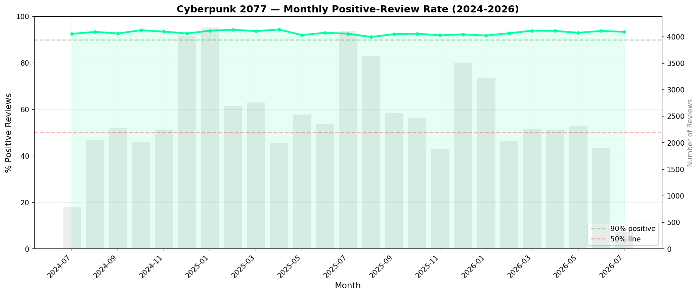
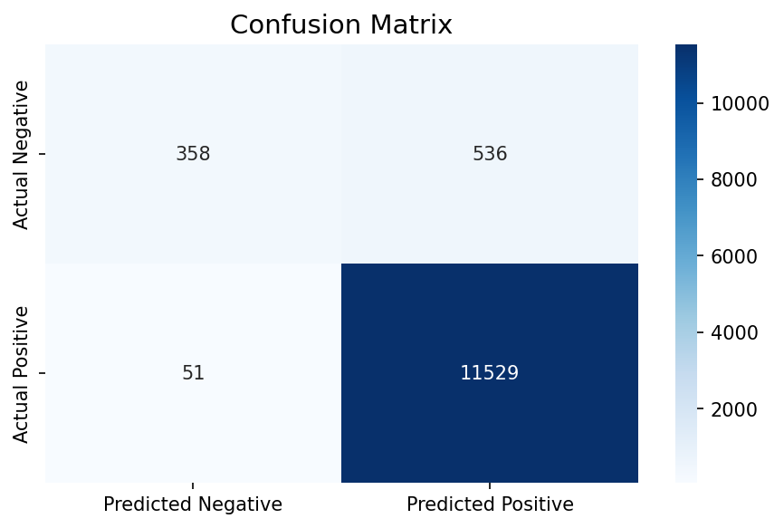
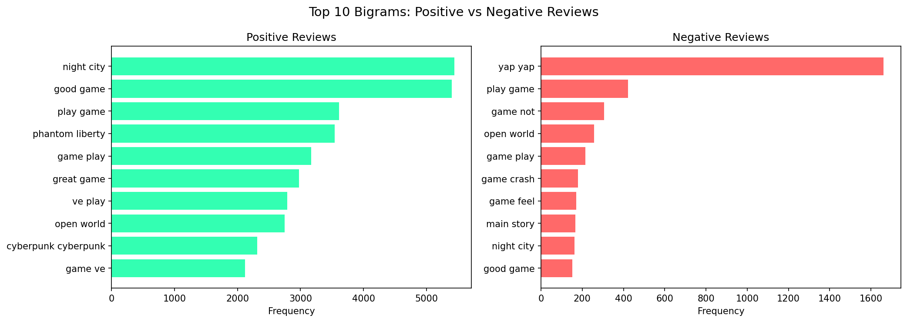
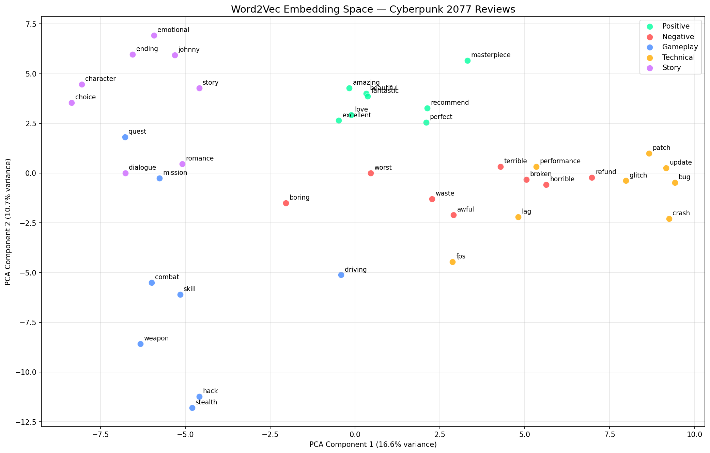
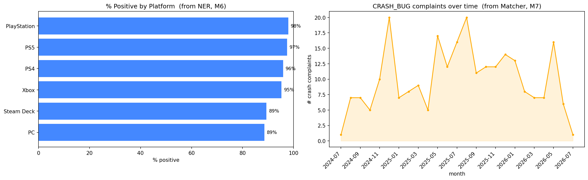
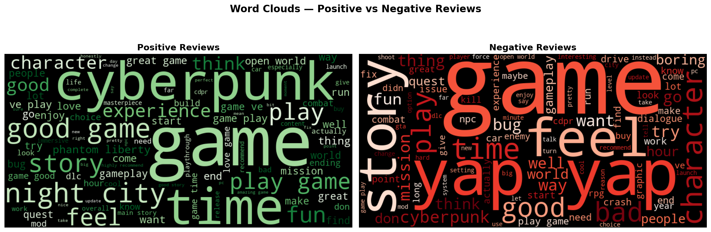

# Sentiment Analysis of Cyberpunk 2077 — Steam Reviews

### A Natural Language Processing Project

Applying **15 NLP methods** to ~92,000 **recent** English-language Steam reviews of
*Cyberpunk 2077* (`app_id 1091500`). The data spans **July 2024 – June 2026** — i.e.
*after* the game's major patches and its 2.0 / Phantom Liberty era — so this is a study of
how players feel about the game **now that it is one of Steam's highly-rated titles**, not a
launch-era "redemption arc."

> **Central question:** *Now that Cyberpunk 2077 is a highly-rated game, how do players feel
> about it today — and what do they praise or complain about?*

---

## Highlights

- **~208k rows** of scraped Steam reviews collected live via the Steam public API.
- End-to-end pipeline: scraping → preprocessing → analysis → embeddings → search → RAG.
- Every technique is tied back to a specific NLP concept, with the underlying math
  (Levenshtein, Dice/Jaccard/Cosine/Overlap, TF-IDF) implemented explicitly.
- A working **search engine** and **RAG** system that answer natural-language questions
  grounded in real player reviews.

---

## The 15 Methods

**Phase 1 — Text Preprocessing (spaCy)**
1. Tokenization
2. Stop-word removal & cleaning (batched with `nlp.pipe()`)
3. Lemmatization
4. Stemming (Porter/Snowball) — compared side-by-side with lemmatization
5. Part-of-Speech tagging — most-used adjectives in positive vs. negative reviews
6. Named Entity Recognition — real-world entities players mention most

**Phase 2 — Analysis**
7. Pattern Matching (spaCy `Matcher`) — praise/complaint phrase detection
8. N-gram Analysis — bigrams & trigrams, positive vs. negative
9. TF-IDF Vectorization
10. Levenshtein Distance — typo detection in reviews
11. N-gram Similarity — Dice, Jaccard, Cosine & Overlap coefficients (implemented by hand)
12. Sentiment Classification — Logistic Regression over TF-IDF features, labeled by
    Steam thumbs-up/down votes

**Phase 3 — Embeddings, Search & RAG**
13. Word Embeddings — Word2Vec (CBOW)
14. Search Engine — TF-IDF + cosine similarity document retrieval
15. RAG — Retrieval-Augmented Generation (retrieve real reviews, then generate a grounded answer)

**Final analysis:** month-by-month positive-sentiment timeline (2024–2026), plus
aspect-level breakdowns (per-platform approval and crash/bug mention frequency) built on
top of NER (M6) and Pattern Matching (M7).

---

## Repository Structure

```
.
├── data/
│   └── steam_reviews_dataset.csv     # ~208k scraped Steam reviews
├── notebooks/
│   └── project_changes.ipynb         # main analysis notebook (all 15 methods)
├── source/
│   ├── scrape_reviews.py             # Steam API scraper
│   └── source.txt                    # API endpoint reference
├── images/                           # generated charts & word clouds
├── presentation/                     # slide deck (PDF + PPTX)
├── .gitignore
└── README.md
```

## Results

| | |
|---|---|
| Sentiment timeline (2024–2026) |  |
| Classifier confusion matrix |  |
| Most frequent bigrams |  |
| Word embeddings |  |
| Aspect analysis |  |
| Word clouds |  |

---

## Getting Started

### 1. Set up the environment

```bash
python3 -m venv .venv
source .venv/bin/activate

pip install pandas numpy scikit-learn spacy nltk gensim \
            python-Levenshtein matplotlib seaborn wordcloud requests

python -m spacy download en_core_web_sm
```

### 2. (Optional) Re-scrape reviews

```bash
python source/scrape_reviews.py
```

The scraper pages through Steam's public review API (`filter=recent`, English only) with a
0.5 s delay between requests to avoid rate limiting.

### 3. Run the notebook

```bash
jupyter notebook notebooks/project_changes.ipynb
```

### 4. (Optional) Enable RAG (Method 15)

The RAG step calls the **Google Gemini** API. Provide a key via an environment variable —
keys are never hardcoded:

```bash
export GEMINI_API_KEY="your-key-here"   # or GOOGLE_API_KEY
```

Without a key, every other method still runs; only the final generation step is skipped.

---

## Data

Reviews are collected from the Steam Store review API for Cyberpunk 2077
(`https://store.steampowered.com/appreviews/1091500`). Each record contains:

| Field | Description |
|---|---|
| `review_text` | The review body |
| `voted_up` | `True` = thumbs up (Positive), `False` = thumbs down (Negative) — used as the classification label |
| `votes_up` | How many other users found the review helpful |
| `playtime_forever` | Reviewer's total playtime (minutes) |
| `timestamp_created` | Unix timestamp — used for the sentiment timeline |

---

## Tech Stack

`spaCy` · `NLTK` · `scikit-learn` · `gensim` (Word2Vec) · `python-Levenshtein` ·
`pandas` / `numpy` · `matplotlib` / `seaborn` · `wordcloud` · Steam API · Google Gemini (RAG)
